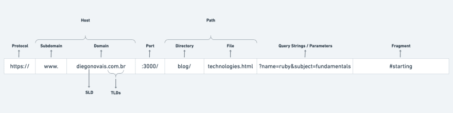

# Aplicação Backend Simples - Prisma | Express 
### Configuração do projeto varia de acordo com cada pessoa, mas todos os passos foram construidos a partir das documentações e boas práticas de código.

#

## Documentação : 
[Prisma ORM](https://www.prisma.io/docs/getting-started/quickstart)

[Express](https://expressjs.com/pt-br/guide/routing.html)
#
## 1 - Iniciar Projeto

```js
  npm init 
  
  //OU

  npm init -y
```
<h3 style="color:orange">Documentação "npm init": <a href="https://docs.npmjs.com/cli/v9/commands/npm-init">LINK</a> </h3>

#
## 2 - Configurar Ambiente para desenvolvimento

```py
  #Instalar Nodemon (devDependencies)

  npm install nodemon -D
  
```

```py
  #Adicionar script para servidor atualizar ao modificar arquivos

  # package.json
  
   "scripts": {
    "start": "node index.js",
    "dev": "nodemon index.js",
    "test": "jest --watch"
  },
```
<h3 style="color:orange">Documentação "nodemon": <a href="https://github.com/remy/nodemon#nodemon">LINK</a> </h3>

#
## 3 - Configuração Incial Express

### Criar um arquivo "server.js" e "index.js" ou deixar tudo em arquivo  (Raiz do Projeto)
**OBS: Nomes dos arquivos não interferem no funcionamento**

```js
  //server.js

  const express = require("express");
  const server = express();

  server.use(express.json());

  module.exports = server;
```

```js
//index.js

  const server = require("./server");

  const PORT = process.env.PORT || 8000;

  server.listen(PORT,() => {
    console.log(`Servidor rodando na porta ${PORT}`);
  });

```

```js
  //Opcional - Facilita caso tenha outras aplicações rodando (sinal de "=" deve estar sem espaços)

  PORT=3000
```

<h3 style="color:orange">Documentação "express": 
  <a href="https://www.npmjs.com/package/express">LINK</a> 
</h3>

#
## 4 - Testar Aplicação

```js
  //Iniciar Aplicação

  npm run dev

```

```js
  //Verificar se existe algum erro no Terminal 

  [nodemon] to restart at any time, enter `rs`
  [nodemon] watching path(s): *.*
  [nodemon] watching extensions: js,mjs,json
  [nodemon] starting `node index.js`
  Servidor rodando na porta 3000
```

```js
  //Abrir projeto no navegador em "http://localhost:PORTA_ESCOLHIDA"
  
  Deve aparecer uma mensagem escrita "Cannot GET /"
```


#
## 5 - Cadastrar Rotas (Por enquanto, sem manipulação do banco de dados)

<br/>

<h3 style="color:orange">Estrutura de uma URL: 
  <a href="https://dev.to/dnovais/estrutura-de-uma-url-357e">LINK</a> 
</h3>
<br/>

```js
  //Exemplo de estrutura 

  router.METODO("/NOME_RECURSO", (request,reponse) => {
    response.status(200).send("Hello World!!");
  })

  //resquest e response - poderiam ser "queijo" e "uva", mas o ideal é usar nomes que fazem sentido
```

```js
  // routes/user

  const express = require("express");
  const router = express.Router();

  router.get("/users", (req,res) => {
    res.send("Método GET - Funcionou")
  })

  router.post("/user", (req,res) => {
    res.send("Método POST - Funcionou")
  })

  router.put("/user/:id", (req,res) => {
    res.send("Método PUT - Funcionou")
  })

  router.delete("/user/:id", (req,res) => {
    res.send("Método DELETE - Funcionou")
  })

  module.exports = router;

```
<h3 style="color:orange">Sobre Métodos HTTP: 
  <a href="https://developer.mozilla.org/pt-BR/docs/Web/HTTP/Methods">LINK</a> 
</h3>
<h3 style="color:orange">Rotas com Express: 
  <a href="https://expressjs.com/en/starter/basic-routing.html">LINK</a> 
</h3>

<br/>


```js
  // server.js - Importar arquivo com rotas dos usuários
   
  ...
  const usersRouter = require('./routes/users');

  server.use(usersRouter);
  
```
#
## 6 - Testar Aplicação Novamente

```js
  - Inicie o POSTMAN, INSOMMINIA, THUNDER CLIENT OU OUTRO
```

<h3 style="color:orange">Insomnia: 
  <a href="https://insomnia.rest/download">LINK</a> 
</h3>
<h3 style="color:orange">Postman: 
  <a href="https://www.postman.com/">LINK</a> 
</h3>
<h3 style="color:orange">Thunder Client: 
  <a href="https://www.thunderclient.com/">LINK</a> 
</h3>


```js
- Crie uma pasta/Folder como nome "users" para facilitar os testes

  - Adicione as requisições com a URL da aplicação 
    - Provavelmente será algo como "http://localhost:PORT/users"
  
  - Crie um requisição para método GET 
    - EX: "http://localhost:PORT/users"

  - Crie um requisição para método POST 
    - EX: "http://localhost:PORT/user"

  - Crie um requisição para método PUT 
    - EX: "http://localhost:PORT/user/1"

  - Crie um requisição para método DELETE 
    - EX: "http://localhost:PORT/user/2"
```

```js 
  
  - Teste cada requisição 
  
  - Se alguma requeisão retornar 404, provavelmente algo na rota esta errado
    - Observe como foi definido no arquivo de configuração das rotas

```

#
## 7 - Configurar prisma - **É necessario ter um banco de dados(XAMPP, Dbeaver, Outro lugar)**

<h3 style="color:orange">XAMPP: 
  <a href="https://www.apachefriends.org/pt_br/index.html">LINK</a> 
</h3>
<h3 style="color:orange">Dbeaver: 
  <a href="https://dbeaver.io/download/">LINK</a> 
</h3>
<h3 style="color:orange">Mysql: 
  <a href="https://www.mysql.com/">LINK</a> 
</h3>

```js
  // Baixar o prisma no projeto

  npm install prisma @prisma/client

```
<h3 style="color:orange">Documentação Prisma: 
  <a href="https://www.prisma.io/docs/getting-started/quickstart">LINK</a> 
</h3>

```js
  // Inciar o prisma

  npx prisma init --datasource-provider mysql

  // Alterar arquivo .env 

  modifcar url de acesso ao banco de dados

```
<h3 style="color:orange">Como montar a url : 
  <a href="https://www.prisma.io/docs/reference/database-reference/connection-urls">LINK</a> 
</h3>

#
## 8 - Criar model da aplicação (tabela)

```js
  // prisma/schema.prisma

  model user {
    id Int @id @default(autoincrement())
    name String 
    email String @unique
    password String
  }

```

# 
## 9 - Iniciar cliente do PRISMA

```js
  - Criar arquivo em "db/prisma.js"
```

```js
  // db/prisma.js

  const Prisma = require('@prisma/client');

  module.exports = new Prisma.PrismaClient();
```
# 
## 10 - Criar arquivos onde a aplicação irá se comunicar com banco de dados
<h3 style="color:orange">Operações CRUD Prisma: 
  <a href="https://www.prisma.io/docs/concepts/components/prisma-client/crud">LINK</a> 
</h3>

```js
  // service/user.js
  
  const prisma = require("../db/prisma"); // instancia do prisma


  const getAllUsers = () => {  // bucar todos os usuários
    return prisma.user.findMany();
  }

  const createUser = ({ name, email, password }) => {  // criar usuario
    
    return prisma.user.create({
      data: {
        name,
        email,
        password
      }
    });
  }

  const updateUser = (id, { name, email,password }) => {   // atualizar usuario

    return prisma.user.update({
      where: { id },
      data: {
        name,
        email,
        password
      }
    });
  };

  const deleteUser = (id) => {  // remover usuario
    return prisma.user.delete({
      where: { id }
    })
  }

  module.exports = {   // tornar acessivel em outros arquivos
    getAllUsers,
    createUser,
    updateUser,
    deleteUser,
  }

```

#
## 11 - Utilizar os métodos criados

```js
  // Modificar o arquivo

  // routes/user.js

  const { getAllUsers, createUser, updateUser, deleteUser } = require('../service/userService');

  router.get("/users", async(req,res) => {

    try {
      const users = await getAllUsers();
      res.json({ users });
    } catch (error) {
      res.send(error);
    }

  });

  router.post("/user", async(req,res) => {
    
    try {
      const newUser = await createUser(req.body);
      res.json(newUser);
    } catch (error) {
      res.json(error);
    }

  });

  router.put("/user/:id", async(req,res) => {
    const userId = Number(req.params.id);

    try {
      const updatedUser = await updateUser(userId, req.body);
      res.json(updatedUser);
    } catch (error) {
      res.send(error);
    }

  });

  router.delete("/user/:id", async(req,res) => {
    const userId = Number(req.params.id);

    try {
      const deletedUser = await deleteUser(userId);
      res.json(deletedUser); 
    } catch (error) {
      res.send(error);
    }
  });

```
<h3 style="color:orange">Arquitetura MVC: 
  <a href="https://www.treinaweb.com.br/blog/o-que-e-mvc">LINK</a> 
</h3>

#
## 12 - Testar no POSTMAN, INSOMMINIA, THUNDER CLIENT OU OUTRO

<h3 style="color:orange">Insomnia: 
  <a href="https://insomnia.rest/download">LINK</a> 
</h3>
<h3 style="color:orange">Postman: 
  <a href="https://www.postman.com/">LINK</a> 
</h3>
<h3 style="color:orange">Thunder Client: 
  <a href="https://www.thunderclient.com/">LINK</a> 
</h3>

<h3 style="color:orange">O que é JSON?: 
  <a href="https://www.alura.com.br/artigos/o-que-e-json">LINK</a> 
</h3>

```js
GET ttp://localhost:PORT/users

POST http://localhost:PORT/user
  - Body do tipo Json 
  {
    "name": "Nome teste",
    "email": "teste@email.com",
    "passoword": "54321"
  }

PUT http://localhost:PORT/user/1
 - Body do tipo Json 
  {
    "name": "Nome teste atualizado",
    "email": "teste@email.com",
    "passoword": "54321"
  }

DELETE http://localhost:PORT/user/1


// Execute:  GET -> POST -> GET -> PUT -> GET -> DELETE -> GET 
```

#
## 12 - Criar algo semelhante para outras tabelas


## Em breve...